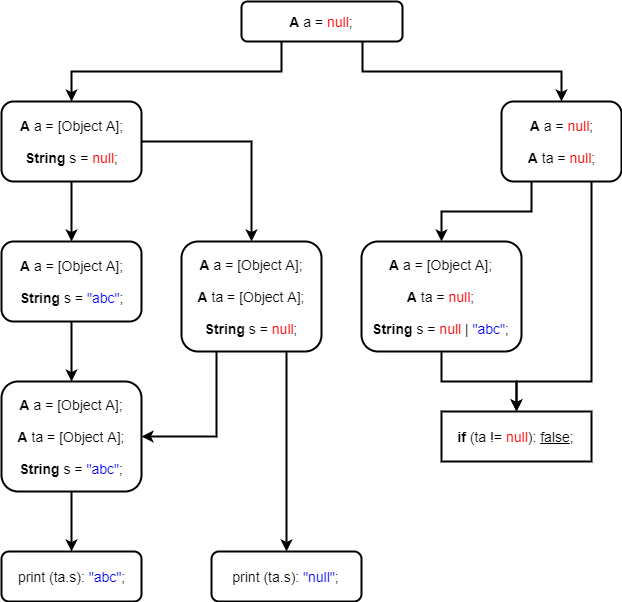
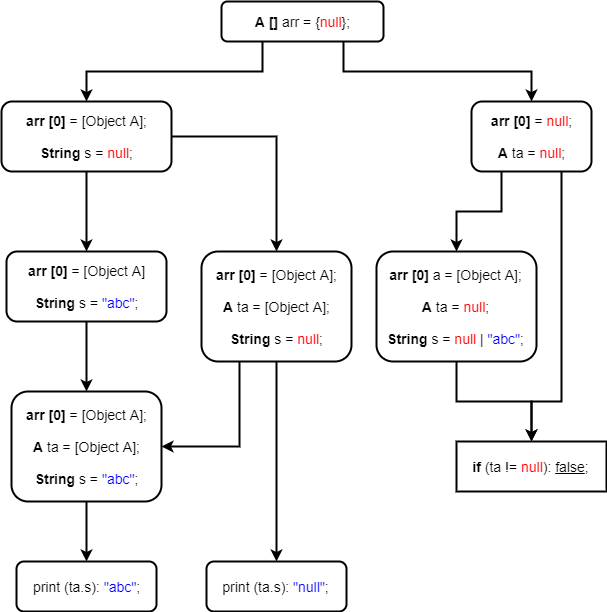
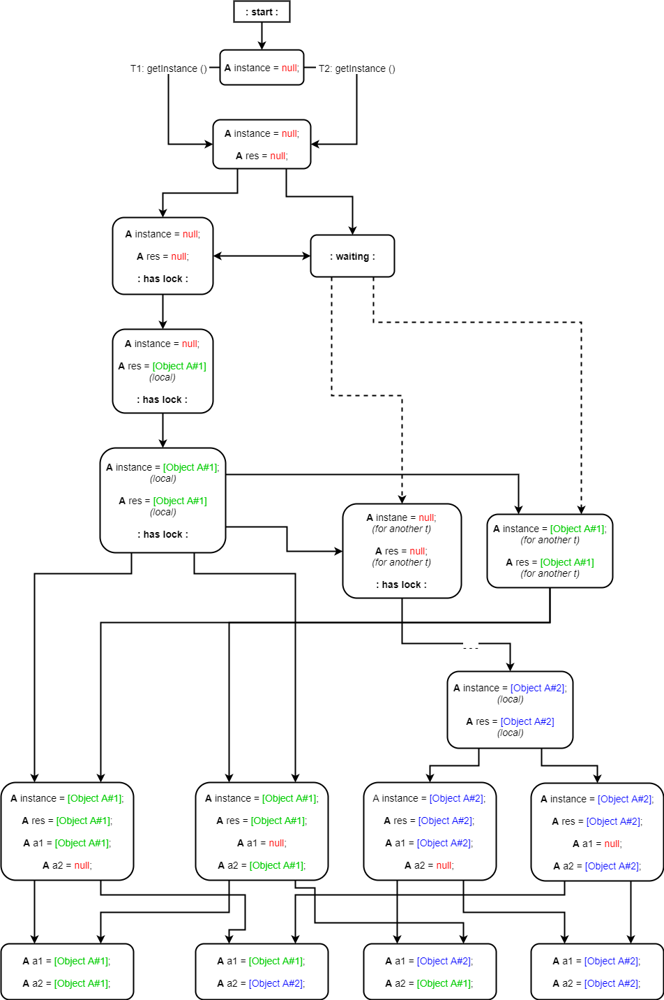

## 1. Data race access

**"abc"**, **"null"**, <ничего>

### Возможные исполнения



### Исправление

Присвоенное значение строки *s* может быть помещено в кэш, но не сброшено в оперативную память.
Чтобы этого избежать, достаточно добавить модификатор **final** к строке (слайд #81).


## 2. Volatile array

**"abc"**, **"null"**, <ничего>

### Возможные исполнения



### Исправление

Присвоенное значение строки s может быть помещено в кэш, но не сброшено в оперативную память.
Чтобы этого избежать, достаточно добавить модификатор final к строке (слайд #81).


## 3. Double-checked locking

**-1**, **0**, <что угодно>

### Возможные исполнения



### Исправление

Основная проблема в том, что может инстанциироваться 2 объекта, поэтому операции ```incX ()```
и ```getX ()``` могут выполниться, но не повлиять друг на друга, потому что переменные ```x```
принадлежат разным экземплярам.

Ну и ещё проблема в том, что ```long``` не атомарен, поэтому пересечение операций чтения
и записи может выдать при чтении что угодно. 
