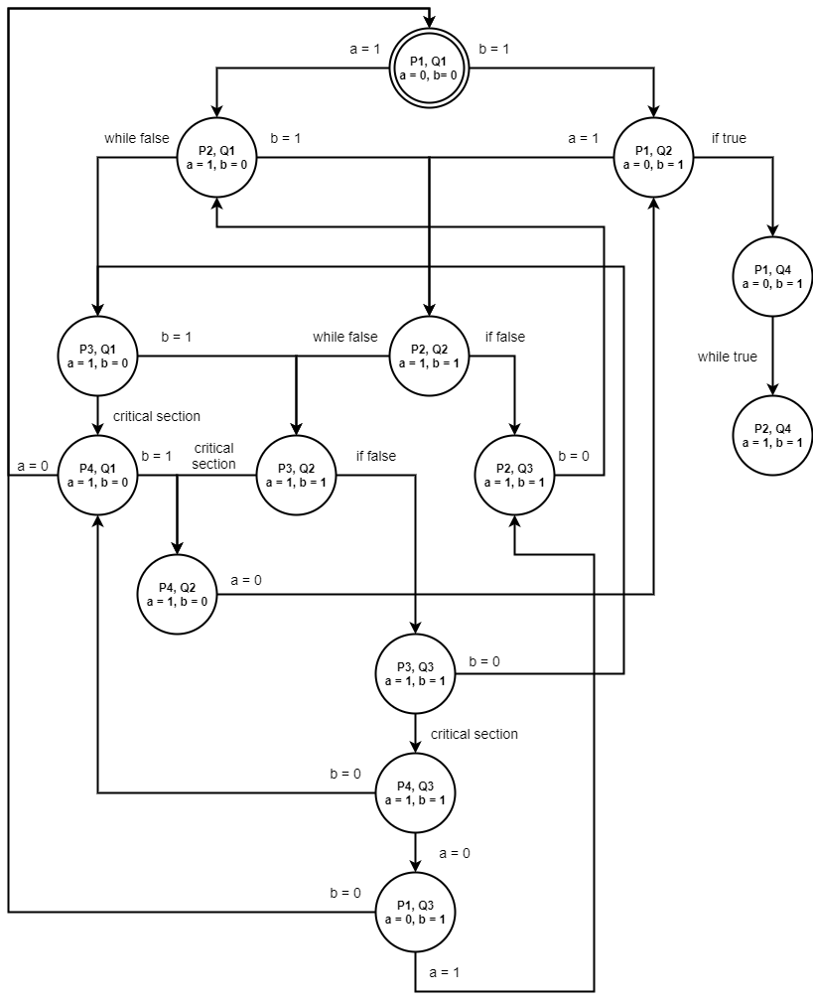

#### 1. Диаграмма исполнения в модели чередования операций

#### 2. Получилось XXX различных состояний

**Ответ**: *14* различных состояний

#### 3. Поток **P** [не] может находиться в состоянии *P3* (critical section) в то время, как поток **Q** находится в состоянии *Qs*

**Ответ**: нет, не возможна, потому что для достижения потоком Р состояния 3 необходимо, чтобы поток Q прошёл состояние 3 и установил значение b равное 0; а для того, чтобы поток Q оказался в 4 состоянии, необходимо, чтобы значение а было равно 0, но это не возможно, т.к. (а = 0) достижимо только в 1 состоянии Р, а у нас он по предположениию в 3.

#### 4. Состояние *Qs* [не]достижимо из ...

**Ответ**: да, верно (Q4 достижима из любого состояния системы), т.к. граф переходов является циклическим за исключением одной терминальной вершины, которая удовлетворяет условию.
